## Preface

This vignette is a tutorial on how to reproduce the single-cell RNA-sequencing analysis described in *He and Lin, et al., 2022* [***(link when available)***]{.ul} using the code and data contained in this R package. Please note, the purpose of these functions is to perform the analysis exactly as published, and they have therefore been coded **very rigidly**. As with any other R package, it can be loaded using the `library()` function:


```r
library(PanethAnalysis)
```

## 1 Package data

This section describes the origin and structure of the data contained within the package

### 1.1 Raw count data

For convenience, the raw count data used for the analysis has been attached to this package and can be inspected by calling `PanethAnalysis::raw_data`. As shown below, the data set is structured as a list of 2 sparse matrices, corresponding to sequencing results generated from cells cultured in either IL22+ or IL22- medium. Each matrix was produced by calling the Seurat function `Read10X(..., strip.suffix=T)` on the *"filtered_feature_bc_matrix"* directory, which is generated as part of the output from the CellRanger toolkit. These data are also accessible in the Gene Expression Omnibus under accession number [GSE189423](https://www.ncbi.nlm.nih.gov/geo/query/acc.cgi?acc=GSE189423) (per sample supplementary data).

<details>

<summary>`str(PanethAnalysis::raw_data)`</summary>


```
## List of 2
## $ IL22+:Formal class 'dgCMatrix' [package "Matrix"] with 6 slots
## .. ..@ i : int [1:6635190] 34 39 53 54 55 66 68 74 76 78 ...
## .. ..@ p : int [1:1428] 0 4253 9220 13102 16870 23027 27604 31870 35880 40126
##    ...
## .. ..@ Dim : int [1:2] 33538 1427
## .. ..@ Dimnames:List of 2
## .. ..@ x : num [1:6635190] 1 2 2 2 2 3 1 1 1 1 ...
## .. ..@ factors : list()
## $ IL22-:Formal class 'dgCMatrix' [package "Matrix"] with 6 slots
## .. ..@ i : int [1:9345713] 27 31 39 40 43 53 54 66 76 77 ...
## .. ..@ p : int [1:2169] 0 4010 6453 11282 12524 16936 20124 23348 26024 32067
##    ...
## .. ..@ Dim : int [1:2] 33538 2168
## .. ..@ Dimnames:List of 2
## .. ..@ x : num [1:9345713] 1 3 4 1 1 3 1 2 1 2 ...
## .. ..@ factors : list()
```

</details>

### 1.2 Spliced/un-spliced count data for RNA velocity

The raw input data required to reproduce the RNA velocity analysis has also been included in this package and can be accessed by calling `PanethAnalysis::velocity_raw`. As shown below, the data set is composed of a single Seurat object (containing data from both conditions) with "Assay" slots corresponding to the "Spliced", "Unspliced" and "Ambiguous" counts ("Spliced" replaces the "RNA" assay in the final object). The production of this object was a multi-step process detailed in the following sub-sections.

<details>

<summary>`str(PanethAnalysis::velocity_raw)`</summary>


```
## Formal class 'Seurat' [package "SeuratObject"] with 13 slots
## ..@ assays :List of 4
## .. ..$ spliced :Formal class 'Assay' [package "SeuratObject"] with 8 slots
## .. ..$ unspliced:Formal class 'Assay' [package "SeuratObject"] with 8 slots
## .. ..$ ambiguous:Formal class 'Assay' [package "SeuratObject"] with 8 slots
## .. ..$ RNA :Formal class 'Assay' [package "SeuratObject"] with 8 slots
## ..@ meta.data :'data.frame': 3595 obs. of 9 variables:
## .. ..$ orig.ident : chr [1:3595] "SeuratProject" "SeuratProject"
##    "SeuratProject" "SeuratProject" ...
## .. ..$ nCount_spliced : num [1:3595] 19870 36368 25304 11011 18198 ...
## .. ..$ nFeature_spliced : int [1:3595] 4409 5603 4431 2995 3966 4073 3247 4974
##    3210 3134 ...
## .. ..$ nCount_unspliced : num [1:3595] 11549 19242 10739 6713 10779 ...
## .. ..$ nFeature_unspliced: int [1:3595] 4104 5062 3777 2866 3769 3643 4325 4496
##    1898 3716 ...
## .. ..$ nCount_ambiguous : num [1:3595] 2529 4431 2650 2049 2155 ...
## .. ..$ nFeature_ambiguous: int [1:3595] 1208 1680 1210 809 1077 1083 1094 1386
##    670 947 ...
## .. ..$ nCount_RNA : num [1:3595] 19870 36368 25304 11011 18198 ...
## .. ..$ nFeature_RNA : int [1:3595] 4409 5603 4431 2995 3966 4073 3247 4974 3210
##    3134 ...
## ..@ active.assay: chr "RNA"
## ..@ active.ident: Factor w/ 1 level "SeuratProject": 1 1 1 1 1 1 1 1 1 1 ...
## .. ..- attr(*, "names")= chr [1:3595] "AAGTGAATCTAGCATG_IL22+"
##    "AATGCCAGTCATCCGG_IL22+" "AACAGGGAGCAGCAGT_IL22+" "AACCACAGTACCAGAG_IL22+"
##    ...
## ..@ graphs : list()
## ..@ neighbors : list()
## ..@ reductions : list()
## ..@ images : list()
## ..@ project.name: chr "SeuratProject"
## ..@ misc : list()
## ..@ version :Classes 'package_version', 'numeric_version' hidden list of 1
## .. ..$ : int [1:3] 4 0 2
## ..@ commands : list()
## ..@ tools : list()
```

</details>

#### 1.2.1 Classifying mapped reads

For each sample, reads mapped by CellRanger were classified as "Spliced", "Unspliced" or "Ambiguous" using a command line script available as part of the [Velocyto](https://velocyto.org/velocyto.py/index.html) python library (see [here](https://velocyto.org/velocyto.py/tutorial/cli.html#run10x-run-on-10x-chromium-samples) for more detailed usage instructions). The required inputs for this script are the directory containing the output from CellRanger and the GTF file containing the transcriptome annotation used to map the reads. The output is a loom file containing the count information per read category.


```bash
# Sample bash command
velocyto run10x -vvv --samtools-memory 5000 --samtools-threads 11 ./10x_output_dir ./genes.gtf
```

#### 1.2.2 Read loom files, create Seurat objects and merge

The loom files generated above were then read into R using the `ReadVelocity()` function from the *SeuratWrappers* package and converted to Seurat objects. The cells were then renamed to match those generated by the pre-processing scripts, detailed later in this vignette, and merged to form the final data set.


```r
library(Seurat)
library(SeuratWrappers)
files <- list("IL22+.loom", "IL22-.loom")
# Read loom files and convert to Seurat objects
object.list <- lapply(files, ReadVeloctiy)
object.list <- lapply(object.list, as.Seurat)
# Rename cells and merge objects
object.list[[1]] <- RenameCells(object.list[[1]], new.names = paste0(gsub(".*:(.+)x", "\\1", colnames(object.list[[1]])),
    "_IL22+"))
object.list[[2]] <- RenameCells(object.list[[2]], new.names = paste0(gsub(".*:(.+)x", "\\1", colnames(object.list[[2]])),
    "_IL22-"))
final.object <- merge(object.list[[1]], object.list[[2]])
final.object[["RNA"]] <- final.object[["spliced"]]
DefaultAssay(final.object) <- "RNA"
```

### 1.3 Cells to exclude

In a previous iteration of this analysis, a group of cells was identified that are defined by their high expression of stress-response genes and cluster independently from all other cells. We chose to exclude them from further analysis. The IDs corresponding to these cells (n = 37) are stored in `PanethAnalysis::stressed_cells`


```r
str(PanethAnalysis::stressed_cells)
##  chr [1:37] "AGTCACAAGACATATG_IL22+" "TCCTTCTGTCCCGGTA_IL22+" "AAAGTGATCATGGATC_IL22-" "ACTGCAATCATGCCAA_IL22-" ...
```

### 1.4 Cell-cycle genes

A list of cell-cycle genes used for cell-cycle scoring is stored in `PanethAnalysis::cc_genes`. This list can also be downloaded from the corresponding [Seurat vignette](https://satijalab.org/seurat/articles/cell_cycle_vignette.html), and is based on the findings from [Tirosh et al, 2015](https://pubmed.ncbi.nlm.nih.gov/26430063/). Genes [1:43] are S-phase specific and genes [44:97] are G2/M specific.


```r
str(PanethAnalysis::cc_genes)
##  chr [1:97] "MCM5" "PCNA" "TYMS" "FEN1" "MCM2" "MCM4" "RRM1" "UNG" "GINS2" "MCM6" "CDCA7" "DTL" "PRIM1" "UHRF1" "CENPU" "HELLS" ...
```

## 2 Data processing and clustering

This section details the core data processing pipeline, which takes the raw count data as input and returns a Seurat object in which IL22+ and IL22- cells have been integrated, graph based clustering and cluster annotation have been performed, and that contains PCA and UMAP projections. For convenience's sake, the code required to perform these steps has been wrapped in a group of 3 functions: `preprocess_data()`, `integrate_data()` and `process_data()`, each of which will be discussed in more detail in the following sections. To quickly reproduce the final object, the output from each step can be directly fed into the subsequent function using the pipe operator `%>%`.

### 2.1 Pre-processing the data

In this first step, performed by the function `preprocess_data()`, the raw count data is merged, filtered and converted into a Seurat object with useful metadata values attached. By default, this function reads the raw count data stored in `PanethAnalysis::raw_data`, so no arguments need to be passed when it's called. The precise actions performed by this function are as follows:

1.  Condition strings (IL22+ or IL22-) are appended to the cell barcodes to produce unique cell ID's (required to merge)

2.  Useful metadata values are calculated, including:

    -   Percentage of mitochondrial transcripts, stored as "percent_mito"

    -   Log2 transcript counts, stored as "log2_counts"

    -   Log2 gene counts, stored as "log2_features"

3.  Count and metadata tables (per condition) are merged

4.  Mitochondrial transcripts are removed, as well as the "stressed" cells (see [1.3 Cells to exclude])

5.  A Seurat object is created (transcripts expressed in fewer than 3 cells are excluded at this point)

6.  Low quality cells are filtered using the following cutoffs:

    -   Number of transcripts per cells \>= 3000 and \< 60000

    -   Percentage of mitochondrial transcripts \< 25%


```r
step1.output <- preprocess_data()
## Reading data...
## Preprocessing...
## Merging files...
## Creating Seurat object and filtering...
```


### 2.2 Data integration

To enable the joint analysis of cells cultured under different conditions, we now perform data integration on the filtered Seurat object by calling `integrate_data()`. This function combines the steps described in detail in the [Seurat vignette on SCT-normalized data integration](https://satijalab.org/seurat/articles/integration_introduction.html#performing-integration-on-datasets-normalized-with-sctransform-1) (see also [Stuart and Butler et al, 2019](https://www.cell.com/cell/fulltext/S0092-8674(19)30559-8)). Briefly, the steps performed include:

1.  Splitting the object per condition (IL22+ and IL22-) and applying normalization to each. As alluded to above, we used SCTransform normalization (see [Hafemeister and Satija, 2019](https://genomebiology.biomedcentral.com/articles/10.1186/s13059-019-1874-1) for more details on this method) by calling the function `Seurat::SCTransform()`, using the default parameters.

2.  Defining and preparing the genes (n=3000) to be integrated by calling `Seurat::SelectIntegrationFeatures()` and `Seurat::PrepSCTIntegration()`

3.  Selecting and refining the integration anchors by calling `Seurat::FindIntegrationAnchors()`

4.  Performing the final data integration by calling `Seurat::IntegrateData()` and returning the resulting Seurat object as output


```r
step2.output <- integrate_data(data = step1.output)
## Applying SCT normalization...
## Preparing for integration...
## Integrating data...
```


**NOTE:** Should you receive the error below, you need to increase the size limit for global variables accessed by functions passed in the `future` package. This can be done by setting `options(future.globals.maxSize = 1000 * 1024^2)`, for example (1GB limit). Be aware that this will increase RAM usage, so use carefully. More information can be found [here](https://satijalab.org/seurat/articles/future_vignette.html).


```r
"The total size of the X globals that need to be exported for the future expression ('FUN()') is X GiB.
   This exceeds the maximum allowed size of 500.00 MiB (option 'future.globals.maxSize').
   The X largest globals are ..."
```

### 2.3 Process data

After the data has been integrated across conditions, we perform some basic processing and analysis operations by calling `process_data()`. The specific steps are detailed in the following subsections.


```r
final.output <- process_data(data = step2.output)
## Running PCA...
## Running UMAP...
## Running graph-based clustering...
## Running cell cycle inference...
## Annotating clusters...
```


#### 2.3.1 Dimensional reduction and graph-based clustering

First, we perform 2 dimensional reduction steps, followed by graph-based clustering. The specific steps include:

1.  Running principal component analysis (PCA) on the integrated data by calling the function `Seurat::RunPCA()`, using the default parameters

2.  Performing uniform manifold approximation and projection (UMAP), using the first 25 integrated principal components as input, by calling `Seurat::RunUMAP()`

3.  Computing a (shared) nearest-neighbor graph by calling `Seurat::FindNeighbors()`, also using the first 25 integrated principal components as input, and clustering the output by calling `Seurat::FindClusters()` (resolution=0.8, Leiden algorithm).

#### 2.3.2 Cell-cycle scoring

Next, we infer the cell-cycle phase of each single cell by calling `Seurat::CellCycleScoring()`. As described [here](https://satijalab.org/seurat/articles/cell_cycle_vignette.html#assign-cell-cycle-scores-1), this function calculates G2/M and S-phase module scores using the gene list stored in `PanethAnalysis::cc_genes` and assigns each cell to a discrete phase based on the results.

<!--#Module score: A module score (see Tirosh et al, 2016) is a numerical value representing (roughly) the expression, per cell, of a group of query genes (the "module"), compared to a set of control genes with similar average expression across the full data set. Therefore, cells with a high module score for a particular gene set have higher than average expression of the query genes, while a low (or negative) module score indicates lower than average expression of the module. -->

#### 2.3.3 Cluster annotation

Finally, we assign each cluster to a known cell type. In nearly all cases, this was done through manual examination of differential gene expression analysis <!--# Add the results as output? --> per cluster. The exceptions to this are detailed below:

-   Mature Paneth and goblet cells (derived from a common progenitor) clustered together. Therefore, in order to distinguish the 2 cell types, we calculated a module score using Paneth-specific marker genes (DEFA5, DEFA6, PLA2G2A, PRSS2, REG3A and ITLN2) and classified cells with a score \> 1.5 as Paneth cells.

-   A small (n=6) group of cells expressing high levels of Tuft marker genes (e.g. AVIL, ALOX5) was distinguished using the `Seurat::FindSubCluster()` function on the secretory progenitor cluster (resolution=1, Leiden algorithm).

### 2.4 Output figure plots {.tabset}

Using the final processed object as input, a number of the manuscript figure panels can be reproduced by calling `plot_processed()` and specifying which figure to plot with `figure=""`. By default, the generated plots are sent to the active graphics device for visualization. The output plots can also be saved as pdf files by specifying `save = TRUE` and giving the path to the desired output directory using `save.dir=` (defaults to "."). The accepted figure IDs include: "**1G**", "**1H**", "**2C**", "**S2A**", "**S2B**", "**S6A**", "**S6B**" and "**S7A**". A description of each output figure can be found in the function documentation (`?plot_processed`).

#### Figure 1G


```r
plot_processed(object = final.output, figure = "1G", save = F, save.dir = ".")
```

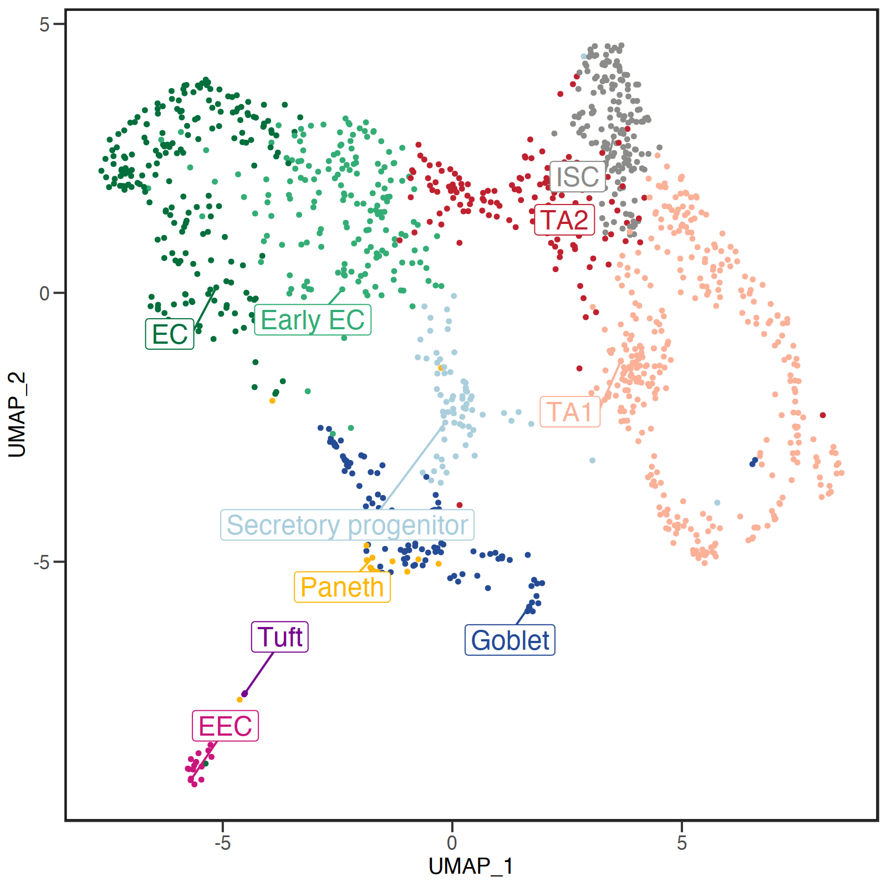

#### Figure 1H


```r
plot_processed(object = final.output, figure = "1H", save = F, save.dir = ".")
```

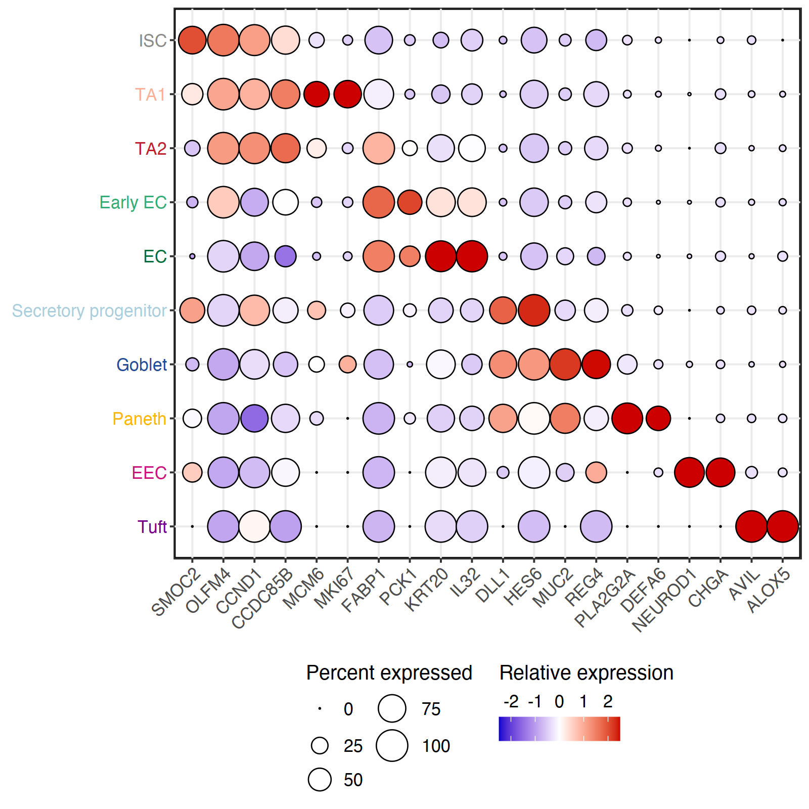

#### Figure 2C


```r
plot_processed(object = final.output, figure = "2C", save = F, save.dir = ".")
```

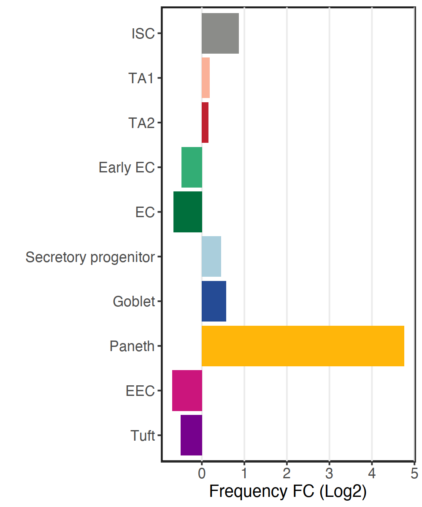

#### Figure S2A


```r
plot_processed(object = final.output, figure = "S2A", save = F, save.dir = ".")
```

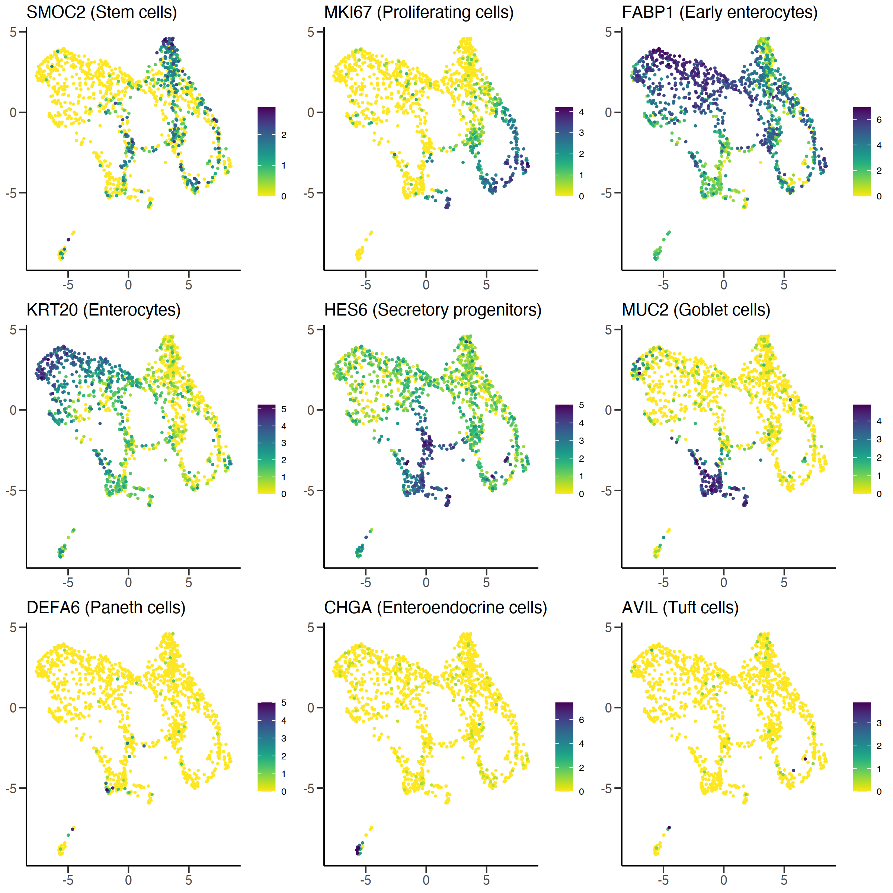

#### Figure S2B


```r
plot_processed(object = final.output, figure = "S2B", save = F, save.dir = ".")
```

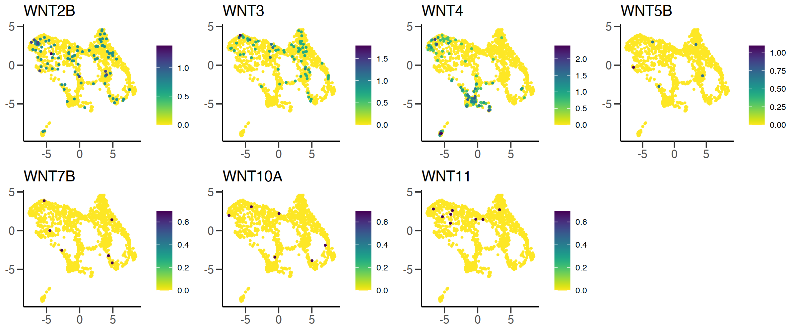

#### Figure S6A


```r
plot_processed(object = final.output, figure = "S6A", save = F, save.dir = ".")
```

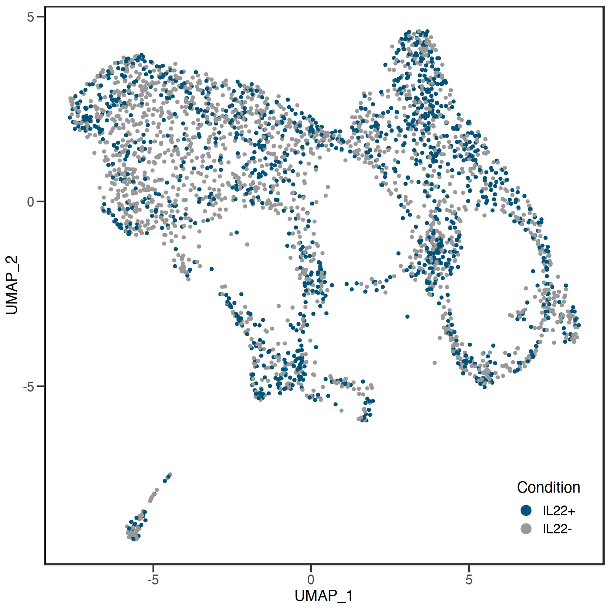

#### Figure S6B


```r
plot_processed(object = final.output, figure = "S6B", save = F, save.dir = ".")
```

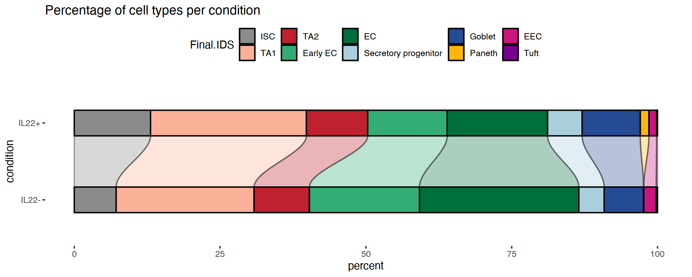

#### Figure S7A


```r
plot_processed(object = final.output, figure = "S7A", save = F, save.dir = ".")
```

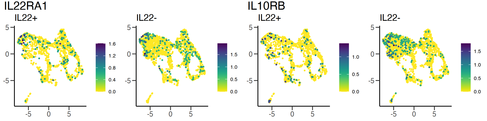

## 3 Advanced analyses

The output from the data processing and clustering pipeline is used as the input for functions carrying out advanced analyses, as detailed below. These include the analysis of the cellular response to IL22, modelling the organoid differentiation trajectories, and RNA velocity analysis.

### 3.1 IL22 response analysis

The steps required to reproduce the analysis and figure panels related to the IL22 response are wrapped in the function `il22_response()`. This function takes the processed Seurat object as input, and returns the same Seurat object with an IL22 induced module score included in the metadata, as well as saving the results of the differential gene-expression (DGE) analyses to disk. The function performs 2 main steps:

1.  Runs the differential gene expression analysis, comparing IL22+ vs IL22- cells across the entire data set, as well as per cell-type cluster. This is done by calling the `Seurat::FindMarkers()` function (Wilcoxon rank sum test). The output from each DGE analysis is saved to disk as "*DE_IL22.txt"* and "*DE_IL22_perCluster.txt"*, respectively (path can be specified using `il22_response(…, output_dir="./")`). **NOTE**: DGE analysis is time consuming and can take between 5 and 10 minutes to complete

2.  Calculates an IL22 induced module score using the top 50 up-regulated genes in the IL22+ condition (based on average log2 fold-change dataset-wide). This is stored in the output Seurat object's metadata slot under *"IL22_Module"* .


```r
il22.output.obj <- il22_response(data = final.output, output_dir = "./")
## Running DGE (IL22+ vs IL22-), this may take awhile...
## Running DGE (IL22+ vs IL22-) per cell-type...
## Calculating IL22 module score...
```

#### 3.1.1 Output figure plots {.tabset}

The output from `il22_response()` can be used to re-produce the relevant figure panels using the `plot_il22()` function. The accepted figure IDs are: "**2D**", "**S7B**" and "**S7D**"; a description of each panel can be found in the function documentation (`?plot_il22`). When re-producing figure 2D, the DGE analysis output file (full data set) from `il22_response()` ("*DE_IL22.txt"*) needs to be specified using `dge.output=`. As with the other plotting functions, the generated plots are sent by default to the active graphics device for visualization, but can also be saved as pdf files by specifying `save = TRUE` and giving the path to the desired output directory using `save.dir=` (defaults to ".").

##### Figure 2D


```r
plot_il22(object = il22.output.obj, figure = "2D", dge.output = "DE_IL22.txt", save = F, save.dir = ".")
```

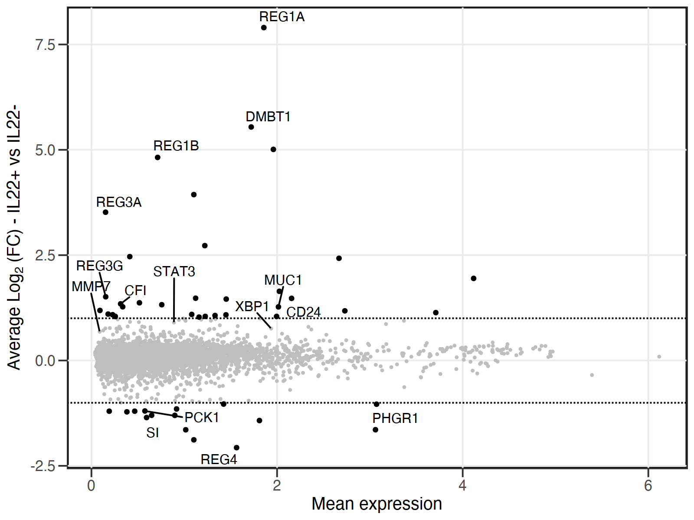

##### Figure S7B


```r
plot_il22(object = il22.output.obj, figure = "S7B", save = F, save.dir = ".")
```

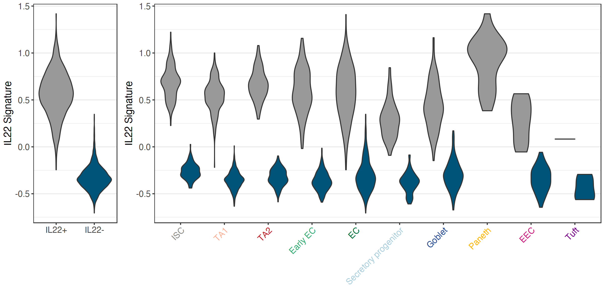

##### Figure S7D


```r
plot_il22(object = il22.output.obj, figure = "S7D", save = F, save.dir = ".")
```

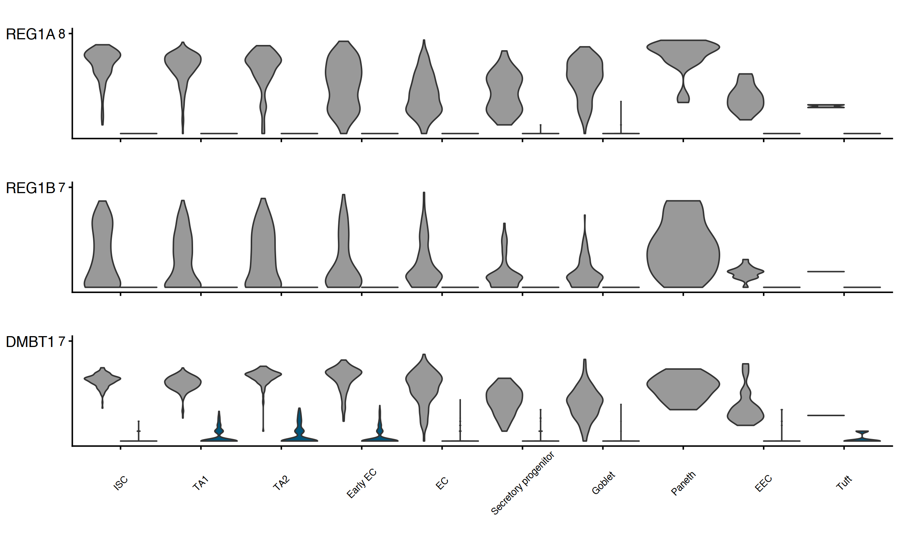

### 3.2 Trajectory modelling

The steps required to reproduce the differentiation trajectory analyses are wrapped in the `model_diffusion()` and `model_slingshot()` functions. The `model_diffusion()` function takes the processed Seurat object as input and returns a list of (subsetted) Seurat objects corresponding to the 4 differentiation trajectories: stem cell, secretory, enterocyte and Paneth. For each trajectory, cells of interest are projected in DiffusionMaps space by calling the function `destiny::DiffusionMap()` (with default parameters), using the top 25 integrated principal components as input. The resulting eigenvectors are then stashed in the respective Seurat object as a new dimensional reduction ("dc"). The output from `model_diffusion()` can then be used as input for `model_slingshot()`, which applies the [slingshot algorithm](https://bmcgenomics.biomedcentral.com/articles/10.1186/s12864-018-4772-0) to each trajectory using the top 2 DiffusionMaps eigenvectors, respectively. The function then returns a list containing the slingshot output for each trajectory.


```r
diffusion.output <- model_diffusion(data = final.output)
## Running DiffusionMaps on secretory trajectory...
## Running DiffusionMaps on enterocyte trajectory...
## Running DiffusionMaps on Paneth trajectory...
## Running DiffusionMaps on stem trajectory...
slingshot.output <- model_slingshot(data = diffusion.output)
```

#### 3.2.1 Output figure plots {.tabset}

The outputs from `model_diffusion()` and `model_slingshot()` can be used to re-produce the relevant figure panels using the `plot_trajectory()` function. The accepted figure IDs are: "**S3B**" and "**S3C**"; a description of each panel can be found in the function documentation (`?plot_trajectory`). As with the other plotting functions, the generated plots are sent to the active graphics device by default for visualization, but can also be saved as pdf files by specifying `save = TRUE` and giving the path to the desired output directory using `save.dir=` (defaults to ".").

##### Figure S3B


```r
plot_trajectory(seurat.obj = diffusion.output, slingshot.obj = slingshot.output, figure = "S3B",
    save = F, save.dir = ".")
```


##### Figure S3C


```r
plot_trajectory(seurat.obj = diffusion.output, slingshot.obj = slingshot.output, figure = "S3C",
    save = F, save.dir = ".")
```

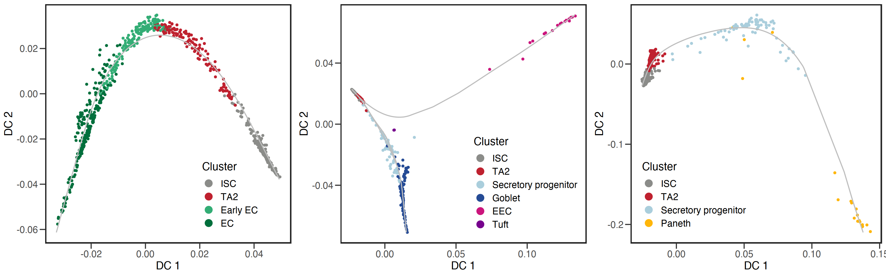

### 3.3 RNA velocity analysis

The raw RNA velocity input data is bundled in this package as `PanethAnalysis::velocity_raw`, and a full description of its generation and structure can be found in the section [1.2 Spliced/un-spliced count data for RNA velocity]. The steps required to prepare the data for analysis using the [scVelo python package](https://scvelo.readthedocs.io/) are wrapped in the `prep_velocity()` function. This function takes the processed Seurat object as input and transfers the PCA and UMAP embeddings to the raw velocity data object (read internally). The raw velocity data is then subset to include only IL22+ cells, and exported as an h5ad file using the `SeuratDisk::SaveH5Seurat()` and `SeuratDisk::Convert()` functions (saved as "*srat_velo.h5ad*", path can be specified via `output.dir = ""`).


```r
prep_velocity(object = final.output, output.dir = ".")  # doesn't return an object
## Subsetting data...
## Creating output file...
## Creating h5Seurat file for version 3.1.5.9900
## Validating h5Seurat file
## [1] TRUE
```

After running `prep_velocity()`, the RNA velocity analysis can be reproduced along with Figure S3A by executing the following python code, based on the vignette found [here](https://scvelo.readthedocs.io/DynamicalModeling/).

| **NOTE**: Installation instructions for scVelo can be found [here](https://scvelo.readthedocs.io/installation/).


```python
# Python code
import scvelo as scv
import os
import numpy as np

adata = scv.read("srat_velo.h5ad") # output from prep_velocity()

scv.pp.filter_and_normalize(adata, min_shared_counts=20, n_top_genes=2000)
scv.pp.moments(adata, n_pcs=25, n_neighbors=30, use_rep="X_pca")
scv.tl.recover_dynamics(adata)
scv.tl.velocity_graph(adata)
scv.pl.velocity_embedding_grid(adata, basis="umap",color="Final.IDS",arrow_size=2,
                               arrow_length=5,dpi=300,figsize=(10,10),alpha=1, arrow_color="dimgrey",
                              palette=["#006F3C","#CB157C","#33AD75","#254B95","#8b8c89",
                                       "#FFB60A","#AACEDC","#F7A085","#AF0C23","#76018D"],
                               size=35,title="",save="Figure_S3A.pdf")
```

#### Figure S3A

<center>

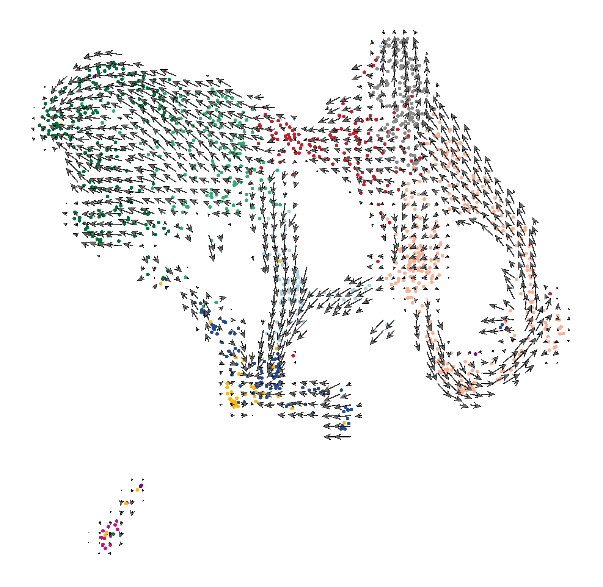{width="600"}

</center>

<details>

<summary>**Session Info**</summary>


```r
sessionInfo()
## R version 4.1.0 (2021-05-18)
## Platform: x86_64-apple-darwin17.0 (64-bit)
## Running under: macOS Big Sur 11.2.3
## 
## Matrix products: default
## LAPACK: /Library/Frameworks/R.framework/Versions/4.1/Resources/lib/libRlapack.dylib
## 
## locale:
## [1] en_US.UTF-8/en_US.UTF-8/en_US.UTF-8/C/en_US.UTF-8/en_US.UTF-8
## 
## attached base packages:
## [1] stats     graphics  grDevices utils     datasets  methods   base     
## 
## other attached packages:
## [1] PanethAnalysis_0.1.0 rvest_1.0.2          dplyr_1.0.7         
## 
## loaded via a namespace (and not attached):
##   [1] scattermore_0.7             ggthemes_4.2.4              princurve_2.1.6             SeuratObject_4.0.2         
##   [5] tidyr_1.1.3                 bit64_4.0.5                 ggplot2_3.3.5               knitr_1.33                 
##   [9] irlba_2.3.3                 DelayedArray_0.18.0         data.table_1.14.0           rpart_4.1-15               
##  [13] TrajectoryUtils_1.0.0       RCurl_1.98-1.3              generics_0.1.0              BiocGenerics_0.38.0        
##  [17] callr_3.7.0                 cowplot_1.1.1               usethis_2.1.3               RANN_2.6.1                 
##  [21] commonmark_1.7              proxy_0.4-26                future_1.21.0               bit_4.0.4                  
##  [25] spatstat.data_2.1-0         xml2_1.3.2                  httpuv_1.6.1                SummarizedExperiment_1.22.0
##  [29] assertthat_0.2.1            viridis_0.6.1               xfun_0.24                   hms_1.1.0                  
##  [33] jquerylib_0.1.4             evaluate_0.14               promises_1.2.0.1            DEoptimR_1.0-9             
##  [37] fansi_0.5.0                 readxl_1.3.1                igraph_1.2.6                DBI_1.1.1                  
##  [41] htmlwidgets_1.5.3           spatstat.geom_2.2-2         stats4_4.1.0                purrr_0.3.4                
##  [45] ellipsis_0.3.2              RSpectra_0.16-0             backports_1.2.1             sparseMatrixStats_1.4.0    
##  [49] deldir_0.2-10               MatrixGenerics_1.4.0        ggalluvial_0.12.3           vctrs_0.3.8                
##  [53] SingleCellExperiment_1.14.1 Biobase_2.52.0              Cairo_1.5-12.2              SeuratDisk_0.0.0.9019      
##  [57] remotes_2.4.0               TTR_0.24.2                  ROCR_1.0-11                 abind_1.4-5                
##  [61] cachem_1.0.5                RcppEigen_0.3.3.9.1         withr_2.4.2                 robustbase_0.93-8          
##  [65] checkmate_2.0.0             vcd_1.4-8                   sctransform_0.3.2           xts_0.12.1                 
##  [69] prettyunits_1.1.1           goftest_1.2-2               cluster_2.1.2               lazyeval_0.2.2             
##  [73] laeken_0.5.1                crayon_1.4.1                hdf5r_1.3.3                 labeling_0.4.2             
##  [77] pkgconfig_2.0.3             GenomeInfoDb_1.28.1         nlme_3.1-152                pkgload_1.2.1              
##  [81] nnet_7.3-16                 devtools_2.4.2              rlang_0.4.11                globals_0.14.0             
##  [85] lifecycle_1.0.0             miniUI_0.1.1.1              cellranger_1.1.0            rprojroot_2.0.2            
##  [89] polyclip_1.10-0             RcppHNSW_0.3.0              matrixStats_0.59.0          lmtest_0.9-38              
##  [93] Matrix_1.3-4                carData_3.0-4               boot_1.3-28                 zoo_1.8-9                  
##  [97] base64enc_0.1-3             ggridges_0.5.3              processx_3.5.2              png_0.1-7                  
## [101] viridisLite_0.4.0           knn.covertree_1.0           bitops_1.0-7                KernSmooth_2.23-20         
## [105] DelayedMatrixStats_1.14.0   stringr_1.4.0               slingshot_2.0.0             parallelly_1.26.1          
## [109] jpeg_0.1-8.1                S4Vectors_0.30.0            scales_1.1.1                memoise_2.0.0              
## [113] magrittr_2.0.1              plyr_1.8.6                  hexbin_1.28.2               ica_1.0-2                  
## [117] zlibbioc_1.38.0             compiler_4.1.0              RColorBrewer_1.1-2          pcaMethods_1.84.0          
## [121] fitdistrplus_1.1-5          cli_3.1.0                   XVector_0.32.0              listenv_0.8.0              
## [125] patchwork_1.1.1             pbapply_1.4-3               ps_1.6.0                    htmlTable_2.2.1            
## [129] formatR_1.11                Formula_1.2-4               ggplot.multistats_1.0.0     MASS_7.3-54                
## [133] mgcv_1.8-36                 tidyselect_1.1.1            stringi_1.6.2               forcats_0.5.1              
## [137] highr_0.9                   yaml_2.2.1                  latticeExtra_0.6-29         ggrepel_0.9.1              
## [141] grid_4.1.0                  sass_0.4.0                  tools_4.1.0                 future.apply_1.7.0         
## [145] parallel_4.1.0              rio_0.5.27                  rstudioapi_0.13             foreign_0.8-81             
## [149] gridExtra_2.3               smoother_1.1                farver_2.1.0                scatterplot3d_0.3-41       
## [153] Rtsne_0.15                  digest_0.6.27               shiny_1.6.0                 Rcpp_1.0.7                 
## [157] GenomicRanges_1.44.0        car_3.0-11                  later_1.2.0                 RcppAnnoy_0.0.18           
## [161] httr_1.4.2                  colorspace_2.0-2            fs_1.5.0                    tensor_1.5                 
## [165] ranger_0.12.1               reticulate_1.20             IRanges_2.26.0              splines_4.1.0              
## [169] uwot_0.1.10                 spatstat.utils_2.2-0        sp_1.4-5                    plotly_4.9.4.1             
## [173] sessioninfo_1.1.1           xtable_1.8-4                jsonlite_1.7.2              testthat_3.0.4             
## [177] destiny_3.1.1               R6_2.5.0                    Hmisc_4.5-0                 pillar_1.6.1               
## [181] htmltools_0.5.1.1           mime_0.11                   glue_1.4.2                  fastmap_1.1.0              
## [185] VIM_6.1.0                   class_7.3-19                codetools_0.2-18            pkgbuild_1.2.0             
## [189] utf8_1.2.1                  lattice_0.20-44             bslib_0.2.5.1               spatstat.sparse_2.0-0      
## [193] tibble_3.1.2                curl_4.3.2                  leiden_0.3.8                zip_2.2.0                  
## [197] openxlsx_4.2.4              roxygen2_7.1.1              limma_3.48.1                survival_3.2-11            
## [201] rmarkdown_2.9               desc_1.4.0                  munsell_0.5.0               e1071_1.7-7                
## [205] GenomeInfoDbData_1.2.6      haven_2.4.1                 reshape2_1.4.4              gtable_0.3.0               
## [209] spatstat.core_2.2-0         Seurat_4.0.3
```

</details>

<br>
